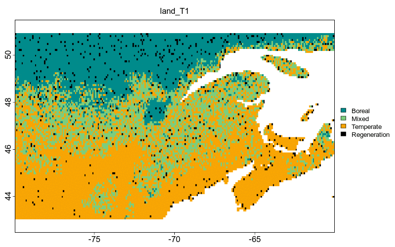

---
output:
  xaringan::moon_reader:
  #  self_contained: TRUE
    includes:
      in_header: conf/style-header.html
    lib_dir: assets
    seal: false
    css: ["default", "conf/css/style.css", "conf/css/fonts.css"]
    nature:
      beforeInit: "conf/style-macros.js"
      slideNumberFormat: | # to add a progress bar
        <div class="progress-bar-container">
          <div class="progress-bar" style="width: calc(%current% / %total% * 100%);">
          </div>
        </div>
---

```{r setup, echo = F}
knitr::opts_chunk$set(
  comment = "#",
  #cache = TRUE,
  collapse = TRUE,
  warning = FALSE,
  message = FALSE,
  fig.width = 7,
  fig.height = 5.25,
  fig.align = 'center'
)

mypar = list(mar = c(3,3,0.5,0.5), mgp = c(1.5, 0.3, 0), tck = -.008)
```
class: middle, title-slide

# L&#39;écologie computationnelle

## Réseaux trophiques des vertébrés terrestres du Québec

<br><br><br><br><br>

### Benjamin Mercier, <br> .small[Étudiant au BSc en écologie]

<br><br><br><br><br>
<i class="fa fa-github fa-2x" style="color:#335049"></i> [BenMerSci/CVM_presentation](https://github.com/BenMerSci/CVM_talk)

<i class="fa fa-twitter fa-2x" style="color:#335049"></i> 
[@BenMerSci](https://twitter.com/BenMerSci)

---
# Déroulement de l'exposé
- Mon cheminement
<br><br>
- Qu'est-ce que l'écologie computationnelle
<br><br>
- Projet de recherche

---
class: inverse, middle, center
# Mon cheminement
---
# Mon cheminement

## Cégep du Vieux Montréal
- Pré-universitaire en Sciences de la nature

## Université de Sherbrooke
- Baccalauréat en écologie
- Microprogramme en écologie pratique
- Découverte d'un intérêt particulier pour l'informatique

---
class: inverse, middle, center
#Qu'est-ce que l'écologie computationnelle?

---
# Définition
- Croisement entre l'écologie et l'informatique
- Permet de réaliser des analyses poussées

---
# Quelques exemples d'application
##1) Modélisation de la migration de la forêt
.center[

]
<br><br>
.tiny[.cite[Vissault, S. [2016.](http://semaphore.uqar.ca/1266/) Diss. Université du Québec à Rimouski]]
---
# Quelques exemples d'application
##2) Les réseaux trophiques marins


.tiny[.cite[Albouy, C. et al. [2019](https://www.nature.com/articles/s41559-019-0950-y) Nature ecology & evolution, .3(8), 1153-1161.]]
---
class: inverse, middle, center
#Reconstitution des réseaux trophiques des vertébrés terrestres

---
